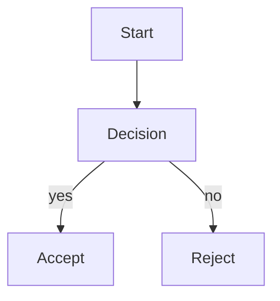
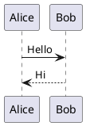

# Authoring Guide

This guide covers everything you need to write and style druckform documents.

## Document format

A druckform document is a standard Markdown file (`.md`) with component directives embedded using `:::` fences.

```markdown
# Document Title

Regular Markdown: **bold**, *italic*, `code`, > blockquotes, lists, tables.

::: component-name param="value"
Children content — also Markdown.
:::
```

Save the file as `document.md` at the root of your ZIP bundle.

## Component syntax

Components are invoked with a `:::` opening fence, parameter attributes, optional children, and a `:::` closing fence:

```markdown
::: infobox title="Key Finding"
The body of the info box supports **Markdown** and nested components.
:::
```

**Parameter rules:**
- All values are strings, quoted with `"`. No bare or single-quoted values.
- Required params: the CLI/MCP will report an error if missing.
- Optional params with defaults: omitting them uses the default from the template.

**Nesting:** components can be nested to any depth:

```markdown
::: infobox title="Outer"
Outer body.
::: infobox title="Inner"
Inner body.
:::
:::
```

To discover all components available for a template, run:

```bash
druck components --template base --json
```

or call the `list_components` MCP tool.

## Built-in components

The components below are from the bundled templates. Run `druck components --template <name>` to see up-to-date parameter lists for your chosen template.

### `infobox` (template: base)

A boxed callout with a title and body.

```markdown
::: infobox title="Key Finding"
Body text. **Markdown** is supported. Nested components are allowed.
:::
```

| Param | Type | Required | Default | Description |
|-------|------|----------|---------|-------------|
| `title` | string | yes | — | Title shown in the box header |
| `accent` | token | no | `accent` | Style token name for the border/header colour |

### `callout` (template: report, extends base)

A variant-styled alert box. Only available in the `report` template (and templates that extend it).

```markdown
::: callout variant="warn" title="Heads up"
Body text.
:::
```

| Param | Type | Required | Default | Description |
|-------|------|----------|---------|-------------|
| `title` | string | yes | — | Title shown in the callout header |
| `variant` | `info` \| `warn` \| `danger` | no | `info` | Visual style variant |

## Diagrams

Embed Mermaid and PlantUML diagrams as fenced code blocks — they are pre-rendered to PDF automatically.

**Mermaid:**

````markdown

````

**PlantUML:**

````markdown

````

Place `.puml` skin files in the `assets/` folder and reference them in your style file via `diagrams.plantuml.skinRef`.

## Templates

Templates define which components are available. Use `druck templates --json` to list all:

| Name | Extends | Description |
|------|---------|-------------|
| `base` | — | Foundational components for all documents |
| `report` | `base` | Extends base with a variant-styled callout |

The `report` template inherits all components from `base` and adds or overrides its own. Template extensions are transitive.

## Style file

Every document needs a style YAML file included in the ZIP bundle. Create `style.yaml`:

```yaml
$schema: "style-v1"
tokens:
  colors:
    accent:    "#2E5AAC"   # primary accent (borders, headers)
    warning:   "#B26A00"   # warning callouts
    infoboxBg: "#EEF3FB"   # info box background
  fonts:
    main: "TeX Gyre Pagella"   # body font (must be a TeX Gyre or system font)
    mono: "JetBrains Mono"     # monospace font
  spacing:
    blockGap: "0.8em"          # vertical gap between blocks
diagrams:
  mermaid:
    theme: "neutral"           # mermaid theme name
  plantuml:
    skinRef: "skin.puml"       # relative to assets/
```

**Token rules:**
- All color values must be `#RRGGBB` (exactly 6 hex digits, # prefix).
- `fonts.main` and `fonts.mono` must be fonts available in the Docker image. The bundled image includes TeX Gyre fonts and common system fonts.
- All `tokens.*` sub-blocks are optional; the render engine applies defaults for missing tokens.
- Additional token names (e.g. `infoboxBg`) are only meaningful if a component reads them via the style schema.
- The `diagrams` block is entirely optional.

## Bundle layout

The ZIP you upload (via `PUT <upload_url>` or `druck render`) must follow this structure:

```
bundle.zip
├── document.md       # required
├── style.yaml        # required (or whatever path you pass as `style`)
└── assets/           # optional — images, PlantUML skins, etc.
    ├── logo.png
    └── skin.puml
```

The `style` argument to `render_document` (MCP) or `--style` flag (CLI) is the path to the YAML file within the bundle, relative to the ZIP root.

**Assemble and upload the bundle:**

```bash
mkdir /tmp/df-bundle
cp document.md style.yaml /tmp/df-bundle/
cp -r assets/ /tmp/df-bundle/assets/ 2>/dev/null || true
cd /tmp/df-bundle && zip -r /tmp/bundle.zip .
curl -X PUT -H "Content-Type: application/octet-stream" \
  --data-binary @/tmp/bundle.zip \
  "<upload_url from render_document>"
```

## Validate before rendering

Run a lint pass to catch authoring errors before triggering the LaTeX pipeline:

```bash
druck lint --template base --in document.md --style style.yaml --json
```

A `findings` array with `severity: "error"` means the document will fail to render. Warnings are informational.

Via MCP: call `validate_document(job_id)` after uploading the bundle and before calling `finalize_job`.
